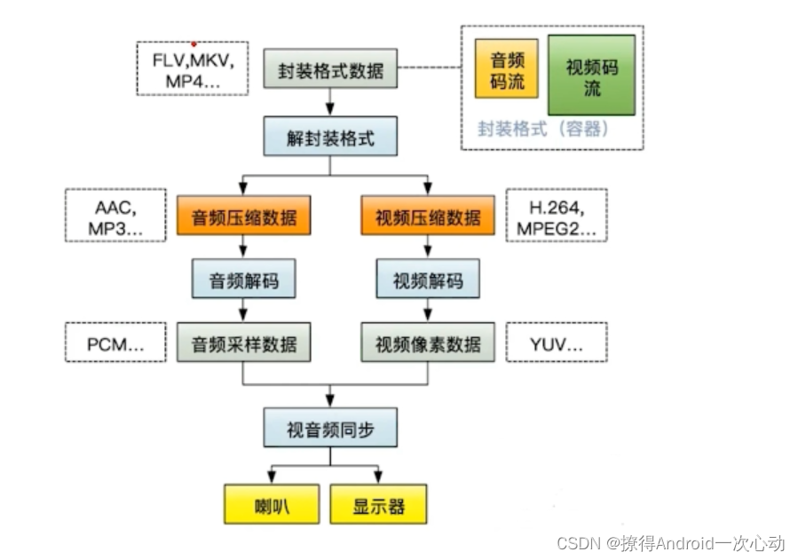
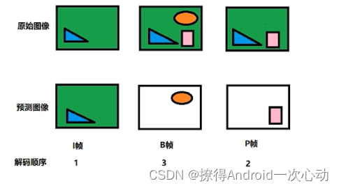

# 音视频开发

#### 关于编解码的解释

+ 视频文件就相当于是：音频码流和视频码流结合封装的一个容器。其中一个视频文件中可以放入多个音频码流和视频码流的文件。
+ 直接逐帧播放图片虽然没有问题，但是这样视频会很大，所以需要编解码，后续图片只记录前面图片变化的部分。
+ 所以说白了：编码就是压缩数据。

#### IPB帧
+ 由于两张图片没有保存全部信息,所以有了一下保存规则：

    **l帧 :帧内编码帧**关键帧，l帧可以看作一个图像经过压缩之后的产物，可以单独解码出一个完整的图像;
    **P帧 :前向预测编码帧**关键帧，记录了本帧跟之前的一个关键帧(或P帧）的差别，解码时需要用之前缓存的画面叠加上本帧定义的差别,生成最终画面。
    **B帧 :双向预测编码帧**关键帧，记录了本帧与前后帧的差别，解码需要参考前面一个l帧或者P帧，同时也需要后面的P帧才能解码一张完整的图像。

#### GOP

+ GOP(序列)：编码器将多张图像进行编码后生产成一段一段的 GOP ( Group of Pictures ) ， 解码器在播放时则是读取一段一段的 GOP 进行解码后读取画面再渲染显示。

#### PTS和DTS
+ 通过上面的描述可以看出：P帧需要参考前面的I帧或P帧才可以生成一张完整的图片，而B帧则需要参考前面I帧或P帧及其后面的一个P帧才可以生成一张完整的图片。这样就带来了一个问题：在视频流中，先到来的 B 帧无法立即解码，需要等待它依赖的后面的 I、P 帧先解码完成，这样一来播放时间与解码时间不一致了，顺序打乱了，那这些帧该如何播放呢？这时就引入了另外两个概念：DTS 和 PTS。

    DTS（Decoding Time Stamp）：即解码时间戳，这个时间戳的意义在于告诉播放器该在什么时候解码这一帧的数据。
    PTS（Presentation Time Stamp）：即显示时间戳，这个时间戳用来告诉播放器该在什么时候显示这一帧的数据。

#### 
