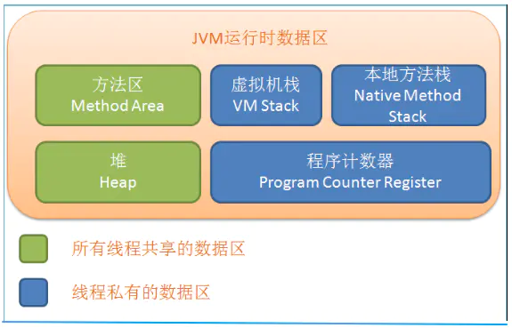
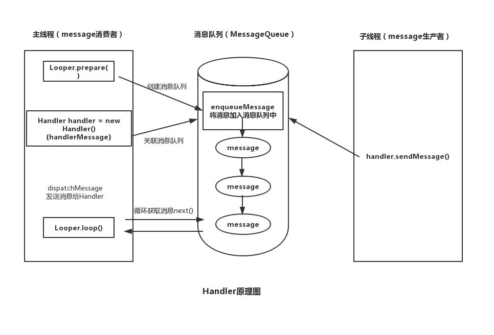

# 一.Java
#### 虚拟机原理

1. 程序技术区(线程私有)：一块较小的内存空间，当前线程所执行的字节码行号指示器
2. 虚拟机栈(线程私有)：它用来保存方法的局部变量、部分结果，并参与方法的调用和返回。
3. 本地方法区(线程私有)：
4. 虚拟机堆(线程共享)：
5. 方法区(线程共享)：

#### 设计模式
+ 观察者：Android当前运用最多的设计模式
+ 单例：一个进程只有单一实例。懒汉，饿汉，双锁，静态内部类，枚举...object。
+ 工厂：
+ 代理模式：by
+ 构建者： builder

# 二.Android

#### 网络编程
+ http/http(1应用层):
  1. HTTPS是加密传输协议，HTTP是明文传输协议
  2. HTTPS需要用到SSL证书，而HTTP不用
  3. HTTPS标准端口443，HTTP标准端口80，等
+ tcp(2传输层):面向链接的通信协议，安全可靠。即先通过三次握手建立链接，再进行数据传输，最后四次挥手释放链接
+ udp(2传输层):无链接通信协议，不可靠。收的只管收，发的只管发
+ ip（3网络层）

#### activity
+ 启动模式：
  1. standard 默认启动模式
  2. singleTop(FLAG_ACTIVITY_SINGLE_TOP) 栈顶单例
  3. singleTask(FLAG_ACTIVITY_NEW_TASK) 栈内单例，复用
  4. singleInstance 单独任务栈。
+ 生命周期：

#### 线程和线程池

+ 线程切换的方法
  1. Thread.start()(可能存在内存泄露)
  2. 线程池开启线程
  3. Handler双向切换线程
  4. runOnUiThread()
  5. view.post()
  6. 协程
  7. RxJava/Android
+ 线程池ThreadPoolExecutor
  1. corePoolSize 核心线程数(一直存活)
  2. maximumPoolSize 最大线程数：减去核心线程数为非核心线程数(超过keepAliveTime时间会自动销毁)
  3. maximumPoolSize 非核心线程闲置销毁时间
  4. workQueue 消息队列，可以设置最大最小数，
  5. unit 时间单位
  6. threadFactory 线程创建工厂
  7. handler 拒绝策略

#### Handler

+ 作用：线程切换
+ Handler：负责发送处理消息(持有Looper,MessageQueue的引用)
+ Looper: 负责循环取出消息给Handler处理(会初始化一个ThreadLocal，MessageQueue,Looper)
  ，通过死循环获取消息再调用handler的dispatchMessage方法分发
+ MessageQueue：消息队列，负责存储消息
+ ThreadLocal: 线程数据存储区，在每个线程中存放各自对应的一个Looper
+ 注意：
    1. 一个线程可以有多个handler,但是只有一个Looper,
    2. 使用Looper必须手动开启循环(Looper.loop())，主线程Looper在activityThread中已经初始化过了，子线程Handler必须手动调用。
+ 

#### 事件分发

+ 事件分发主要由以下三个方法完成:
    1. public boolean dispatchTouchEvent（event）：用于进行点击事件的分发
    2. public boolean onInterceptTouchEvent（event）：用于进行点击事件的拦截(viewGroup专用)
    3. public boolean onTouchEvent（event）：用于处理点击事件
+ 

#### 启动流程

+ 步骤:
    1. init进程创建zygote进程，zygote进程fork出SystemServer进程(AMS,WMS,PMS所在)
    2. launcher进程启动(先不管)
    3. 点击桌面图标时:Launcher -> startActivityActivity() -> mInstrumentation.execStartActivity(
       ActivityThread.getApplicationThread())  
       getApplicationThread是ActivityThread的内部类ApplicationThread，这是一个Binder对象，之后AMS通过此对象与App的通信。
    4. AMS启动Activity并通知Launcher进入Paused状态
    5. 新的进程启动，ActivityThread的main函数入口(进入第二部)
    6. 创建activity(performLaunchActivity)并做如下操作：
        1. 创建要启动activity的上下文环境
        2. 通过Instrumentation的newActivity方法，以反射形式创建activity实例
        3. 如果Application不存在的话会创建Application并调用Application的onCreate方法
        4. 初始化Activity，创建Window对象（PhoneWindow）并实现Activity和Window相关联
        5. 通过Instrumentation调用Activity的onCreate方法

#### jetpack

#### 版本适配

+ 4.4
    + webView添加注解，解决远程注入漏洞
+ 5
    + 新增悬挂Notification
    + materialDesign
    + 引入Toolbar，取代ActionBar
+ 6
    + 运行时权限，部分权限需要动态申请
    + 支持指纹
    + Doze电量管理，手机静止不动一段时间后，会进入Doze电量管理模式，提高续航时间
+ 7
    + 文件分享：禁止通过file://协议分享文件，需要通过FileProvider来生成content://协议操作
    + 多窗口模式（分屏模式）
+ 8
    + 后台service限制，骚操作进程保活基本无效了
    + 广播静态注册已经无效了，需要通过动态注册的方式
    + 通知改进：所有通知都必须分到一个渠道，即新增NotificationChannel
    + 运行时权限策略变化，之前6.0 动态申请某个权限会错误的将对应组权限都开放
+ 9
    + 刘海屏给出官方适配
    + 无法通过application,server启动activity了(解决:添加FLAG_ACTIVITY_NEW_TASK)。
+ 10
    + 分区存储，无法直接访问外部存储，(此版本尚可兼容)
+ 11
    + 强制分区存储
    + 强制需要v2才能安装
    + 强制 设置allowBackup
+ 12
    + 启动优化
    

